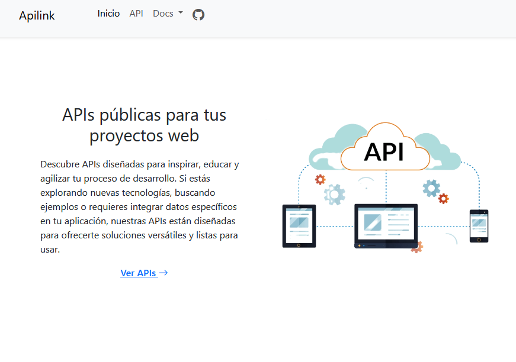

# Apilink - Full Stack project 

Full Stack web service app for providing public APIs to be used in development projects.

## Technologies:

* __Frontend:__ HTML, CSS, Bootstrap, Javascript, Jinja2 
* __Backend:__ Python & Flask
* __Database:__ Mongo DB

## Screenshots

[See online project here!](https://apilink-pukn.onrender.com/)